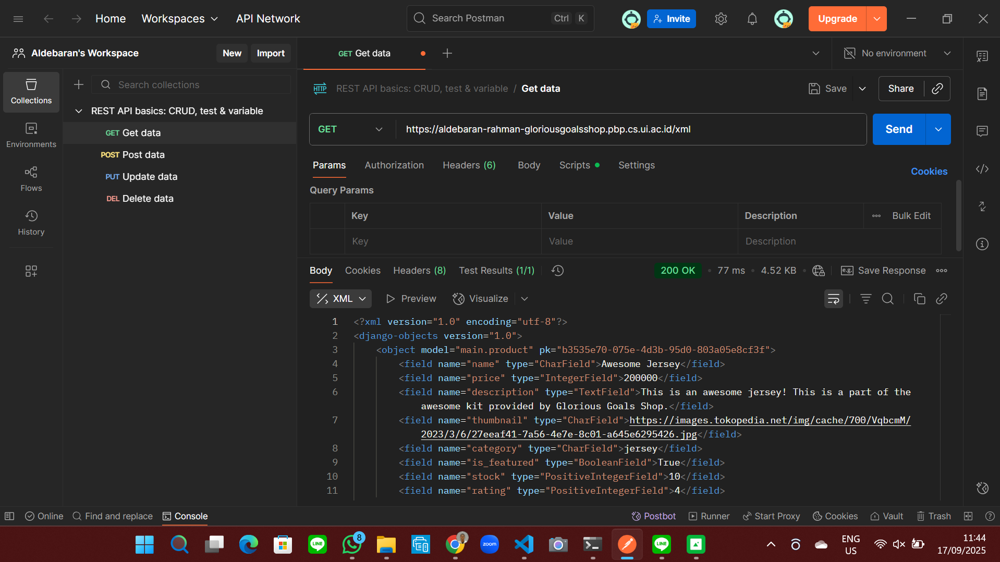
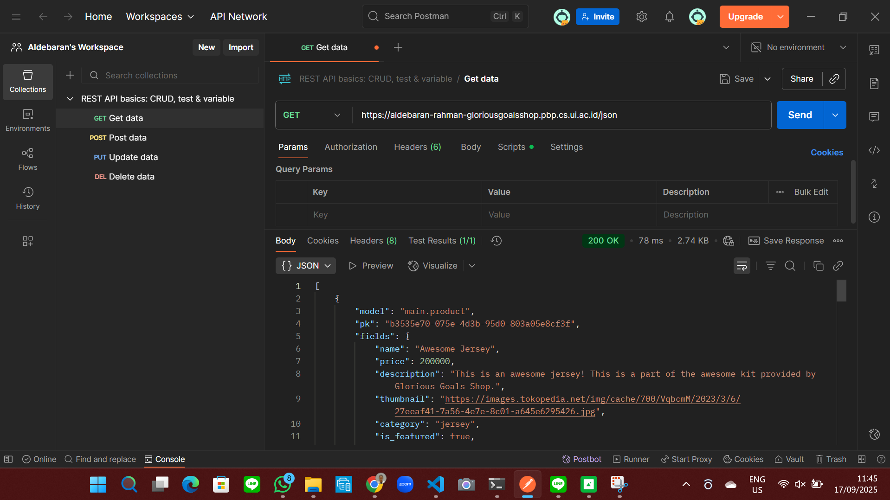
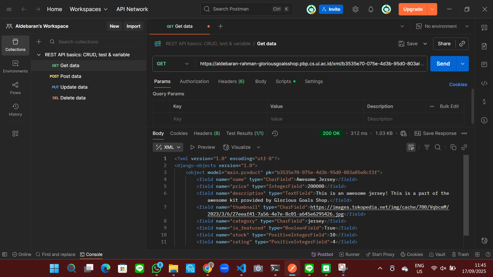
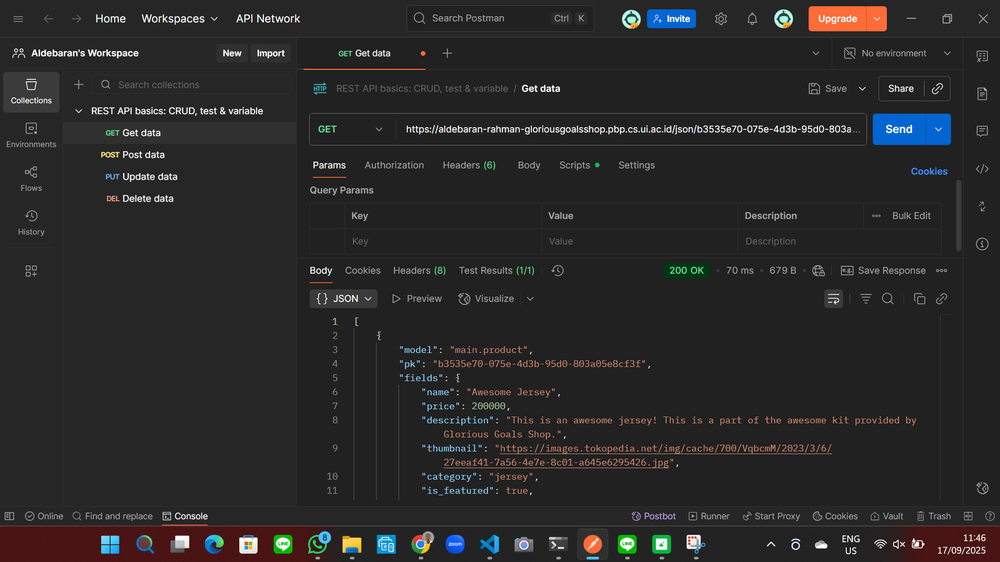

# Assignment 2

[Link to the website](https://aldebaran-rahman-gloriousgoalsshop.pbp.cs.ui.ac.id/)

## Explain how you implemented the checklist above step-by-step (not just by following the tutorial).

1. Creating a new Django project

In this step, I created a new Django project. This is where I had to work with Windows Powershell and Git. One part of this step was to create an application "main" in the project. I then configured the routing in the project to run the "main" application by adding urlpatterns = [path('', show_main, name='show_main'),] in urls.py in the "main" directory.

2. Creating a new model

After creating a new Django project, I continued by creating a new model named "Product" with "name", "price", "description", "thumbnail", "category", and "is_featured" as mandatory attributes as well as "id", "stock", and "rating" as optional attributes. After this, I ran "python manage.py makemigrations" and "python manage.py migrate" to apply the model.

3. Creating a function in views.py

After creating a new model, I went on to create a function in views.py to return a page that displays the name of the application, my name, and my class. This part (views.py) can be thought as the step in which the logic of the website is written.

4. Creating a template

The file views.py should return a page that displays information. To actually display the information, I had to create an HTML file (main.html) to organise how the information should be displayed whenever someone accesses my website. If views.py manages what should be shown, then the template manages how it should be shown.

5. Deploying to Pacil Web Service (PWS)

After writing code, managing logic, and managing how the information should be shown on the website, I deployed my project to Pacil Web Service. This step is important because it allows other people to access my website.

## Create a diagram showing the client request to the Django-based web application and its response, and explain the relationship between urls.py, views.py, models.py, and the HTML file in the diagram.

[Link to source which contains the image above](https://developer.mozilla.org/en-US/docs/Learn_web_development/Extensions/Server-side/Django/Home_page)

urls.py, views.py, models.py, and HTML file(s) work together as a system in order to show a Django-based website. First of all, when the website receives an HTTP request from a user, it is given to urls.py and urls.py sends that request to the correct part in views.py. Depending on the request, views.py can read data from models.py or write data to models.py. The HTML file(s) work with views.py in order to put information on a page. That page is then forwarded to the user based on their initial request. Overall, urls.py, views.py, models.py, and HTML(s) coordinate with each other to receive HTTP requests from users and respond accordingly to those requests.

## Explain the role of settings.py in a Django project!

For me, one description that works best in understanding the settings.py file in Django is that it is analogous to the settings on a mobile phone. The settings of a mobile phone can set the brightness of the phone, set how notifications should be displayed, set the phone is on silent mode, set the phone is on airplane mode, set it to use mobile data, and much more. The settings.py file in a Django project behaves similarly because, for example, allowed hosts can be edited so that it contains more host or domain names, time zone could be set to 'UTC', the language code can be set to 'en-us', and more. From these examples, I think that the role of the settings.py file  in a Django project allows Django developers to configure how their project should work and/or behave such that it aligns with their goals.

## How does database migration work in Django?

From what I understand, a Django model is a representation of a database table in Python. Migrations is how Django tracks any changes made to its database models. Specifically, migrations are orders to change the structure of the database table which is defined in the latest code for the model. In Django, "python manage.py makemigrations" and "python manage.py migrate" are two commands that must run in order so that a database migration can work. The command "python manage.py makemigrations" is usually used after a model has been changed and is used to create migrations for those changes. However, this does not apply the changes made to the database. To apply the changes made to the database, the command "python manage.py migrate" should be used. At its core, database migrations in Django work by using two commands that must be run sequentially where "python manage.py makemigrations" creates migration files based on the changes made to the model and "python manage.py migrate" applies the migration files to the database which updates its schema.

 ## In your opinion, among all existing frameworks, why is the Django framework chosen as the starting point for learning software development?

There many frameworks for software development. However, I think the main reason as to why
Django is chosen is the same reason a beginner would first learn programming. Based on my experience, learning Python is not as complicated as learning other programming languages due to its human-friendly syntax. Beginners can practice computational thinking using Python and apply it to other languages. Are there better programming languages than Python in terms of speed? Of course! C++ is one of them. C++ is a great language when speed matters a lot. For instance, competitive programming puts a lot of emphasis on speed because many solutions must perform under a certain time limit. However, C++ is not as beginner friendly as Python. How does this relate to Django? I think of Django as the Python version of a framework. Beginners who understand Python can quickly transition to Django to develop software and use the thinking process of developing websites in Django to other frameworks. Overall, in my opinion, Django is a good starting point for people to learn software development because it puts more emphasis on how to think as a software developer/engineer rather than focusing on the tiny details.

## Do you have any feedback for the teaching assistant for Tutorial 1 that you previously completed?

I think my teaching assistant during tutorial 1 was great! He is quite communicative and he responds to my questions nicely. Thank you!

# Assignment 3

## Why do we need data delivery in implementing a platform?

Based on what I understand, platforms are usually services. These services provide solutions to solve people's problems. For instance, social media platforms enable people to be more connected with each other through the internet. In the case for social media platforms, not every user is the same. Each user may have a different names, identities, stories, and more. This results in a need to store data and retrieve data to cater to each user's needs. This is where data delivery solves this issue. Data delivery handles the logic for anything that is related to data so websites can display the needed data to users. Therefore, we need data delivery in implementing a platform because its main role in a platform is to handle data.

## In your opinion, which is better, XML or JSON? Why is JSON more popular than XML?

From my perspective, I prefer JSON a lot more than XML. As someone who has had experience with Python, I can read the syntax for JSON much more easily than XML because it is much less verbose. I also find that JSON is much more concise than XML because data is stored in key-value pairs which is similar to how dictionaries work in Python. XML's syntax is much more similar to HTML and, in my experience, HTML repeats keywords (for example: 
This is some text
 (p is repeated)) which makes it more difficult to read.

As to why JSON is much more popular than XML, I think it's because most web applications are based on HTML, CSS, and JavaScript. These three things make up a majority of websites. When many websites use JavaScript, then a format that works reliably, quickly, and easily with JavaScript is needed. Between JSON and XML, JSON fits this demand. Therefore, JSON becomes the preferred format in web development.

## What is the purpose of the is_valid() method in Django forms, and why do we need it?

I think the is_valid() method in Django forms is used to verify every field that is defined in that form. After validating a form, the is_valid() method returns a boolean value to indicate whether or not the form was valid. The primary need for is_valid() is to differentiate how valid data and invalid data should be handled. When the data is valid, web platforms can process the data further to accommodate requests from the users. When the data is invalid, web platforms should not process it and should display errors to indicate that some part of the web platform needs error handling and/or debugging.

## Why do we need a csrf_token when making forms in Django? What can happen if we don't include a csrf_token in a Django form? How can this be exploited by an attacker?

Forms in Django handle data which is inputted by the user. Sometimes, the data given by the user is sensitive and should not be known by other people (for example: bank account information, passwords, emails, and more). This is why csrf_token (csrf is short for Cross-Site Request Forgery) is important. csrf_token is a unique and random string of characters generated by the server to prevent dangerous websites from tricking real, verified users from giving them sensitive data. When a csrf_token is not included, web platforms cannot make sure that a request came from a real user. An attacker can exploit this weakness by performing actions which concern sensitive data.

## Explain how you implemented the checklist above step-by-step (not just following the tutorial).

1. I first had to write a structure for the views which serves a base for other web pages in this project. This results in base.html in the templates folder of the glorious_goals_shop root folder. I also updated the TEMPLATES variable in settings.py so that base.html can work.

2. After writing a base for other web pages, I continued by writing a form so users can input data and display data to the users. This results in create_product.html and product_detail.html in the templates folder of the main folder. The main.html in that same folder is also edited to accommodate the requests in Assignment 3. create_product.html is an HTML page which serves as the page to input a product and product_detail.html displays the specific information of a product. I also had to edit settings.py by adding a CSRF_TRUSTED_ORIGINS variable and add my website as a base so that it can be trusted.

3. To continue with the assignment, I also added four (4) views functions to view objects added by the user in XML, JSON, XML by ID, and JSON by ID. This results in me editing views.py by adding show_xml, show_json, show_xml_by_id, and show_json_by_id as functions. I also had to edit the urls.py file so that the urls of the website can call the correct functions in views.

4. 

## Do you have any feedback for the teaching assistants for Tutorial 2?

I think tutorial 2 was good. In my opinion, the teaching assistants were quite kind and helpful. Thank you!

## Postman Screenshots for point 2

